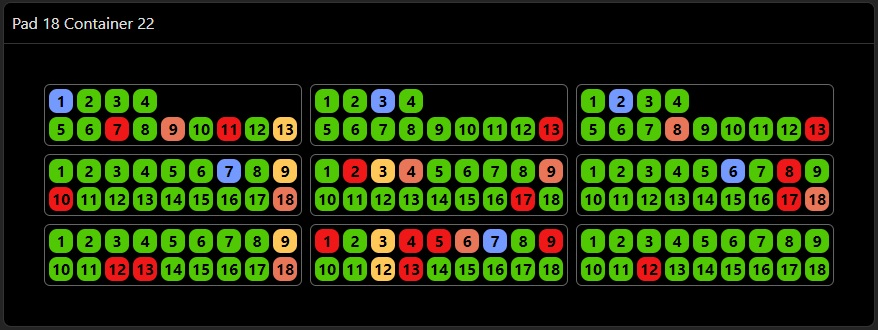
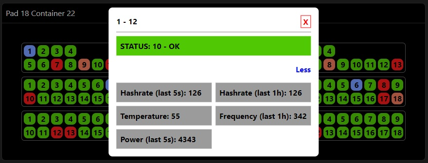

# Project Documentation

## About project

- Project represents a dashboard that provides information on a group of miners
- Project is initialized using [ViteJS](https://vitejs.dev/) and uses MobX as a state container

## Screenshots

  

  

  

## Environment

- Node v21.6.2

## Stack

    
    
    
    
    

## Running a project

- To run the project locally, ensure you have NodeJS version 21.6.2 installed. While the code may work with other versions, it is recommended to use NodeJS v21.6.2 for optimal compatibility.
- Navigate to the root folder of the project.
- Run the `yarn install` command to install all the required packages.
- After the packages have been installed run the `yarn start` command to start the local server
- Open your preferred web browser and navigate to the following URL: `http://localhost:3000`
- You should now have the project running locally on your machine.
- Run the `yarn build` command for building a project for production. Static files will be generated in the `dist` folder.

### Note:

This project is fully packaged and prepared for testing. To launch it, simply navigate to the `dist` folder in your file explorer and open the `index.html` file using your preferred web browser.
